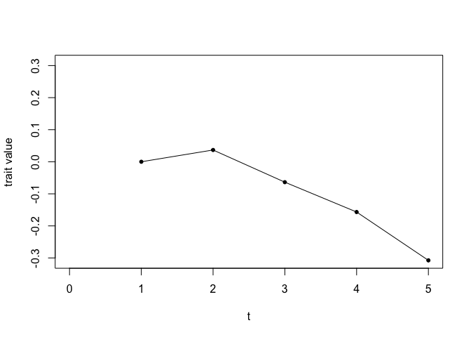
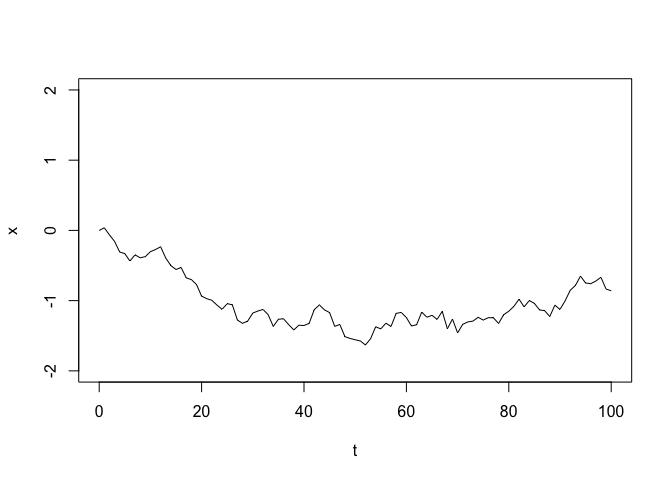
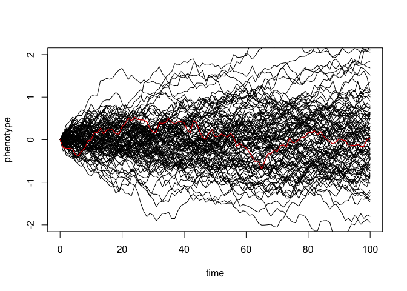
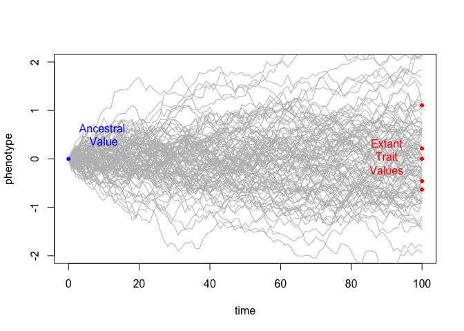
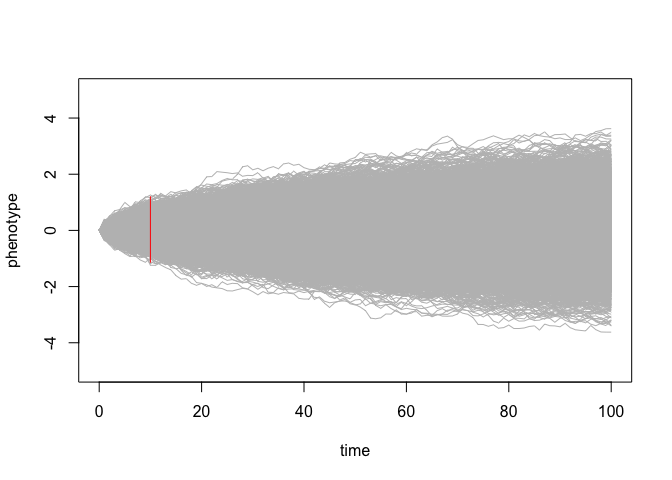
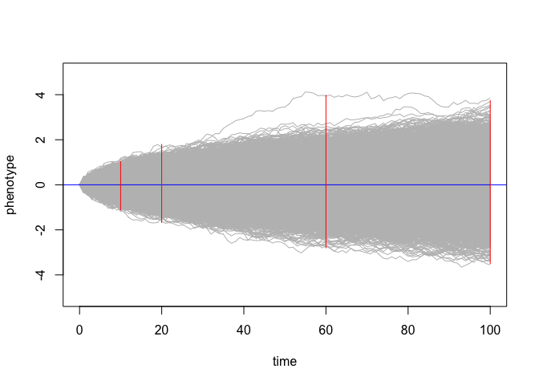
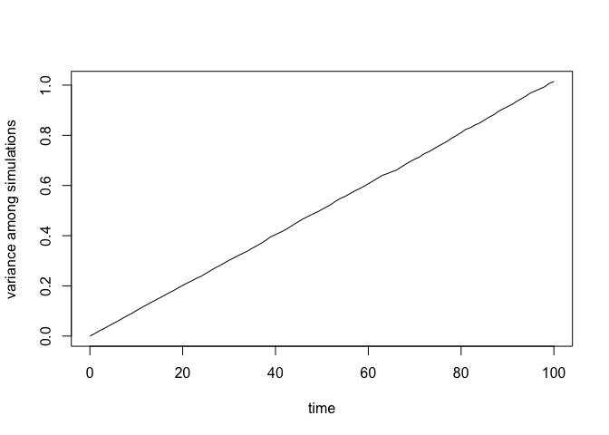

Sample Exercise on Brownian Motion
================
Carrie Tribble and Jenna Baughman
March 20, 2017

Part 1: Brownian motion of a trait over time, following a single lineage
========================================================================

First, we need to initialize our simulations by setting the length of time for the simulation (t). This can also be thought of as the number of generations.

``` r
t <- 0:100  
```

Next, let's initialize the instantaneous rate of change. This determines the relative size of jumps that tend to occur. when sig2 (sigma squared) is small, character state changes tend to be smaller. when its big (maximum of 1), individual state changes tend to be larger.

``` r
sig2 <- 0.01 
```

Now, simulate a set of random deviates. In other words, this is the series of character state changes through time (t). Look at the values of x to get an idea of this.

``` r
x <- rnorm(n = length(t) - 1, sd = sqrt(sig2))
x
```

    ##   [1]  0.036697125 -0.100383088 -0.093088932 -0.150762125 -0.023165603
    ##   [6] -0.105193591  0.087688894 -0.041658590  0.016195900  0.070070925
    ##  [11]  0.031568226  0.038621196 -0.160622213 -0.107273952 -0.055494110
    ##  [16]  0.028647965 -0.147323362 -0.025626797 -0.068701087 -0.166487605
    ##  [21] -0.035813508 -0.023278165 -0.068254679 -0.060014859  0.080758859
    ##  [26] -0.016660848 -0.218306482 -0.044669392  0.030575946  0.114953128
    ##  [31]  0.028635575  0.022980071 -0.075861820 -0.166373112  0.102339978
    ##  [36]  0.006754534 -0.082197806 -0.076597802  0.067018378 -0.004469408
    ##  [41]  0.030406740  0.195303952  0.067353265 -0.069466347 -0.039364951
    ##  [46] -0.196064138  0.026951055 -0.174061270 -0.024615370 -0.019200764
    ##  [51] -0.016837760 -0.056982563  0.088440429  0.170814864 -0.030538481
    ##  [56]  0.081457363 -0.046341250  0.186075156  0.013318382 -0.073827839
    ##  [61] -0.120031986  0.019903331  0.178687175 -0.073415348  0.027183206
    ##  [66] -0.057640017  0.114807534 -0.248378829  0.138353137 -0.196735232
    ##  [71]  0.121691024  0.034290112  0.011814571  0.053481226 -0.038578506
    ##  [76]  0.033546765 -0.002047240 -0.079774375  0.123881672  0.050316248
    ##  [81]  0.069314562  0.101606959 -0.109205797  0.089960992 -0.040588111
    ##  [86] -0.092602593 -0.010811758 -0.082977384  0.160663268 -0.059710944
    ##  [91]  0.121319716  0.151337402  0.067250640  0.134067730 -0.097998405
    ##  [96] -0.009915160  0.038038903  0.052886702 -0.168621830 -0.022434619

The character state starts at 0 then changes by the amount (x). Imagine this a size of some trait, like leaf length. when x is negative, it means it got smaller, and when positive, it got bigger.

    Now compute their cumulative sum. We want cumulative sum because the state a character is in at any time (t) is the sum of all its past transitions. In other words, it started at "0", got bigger by this much, smaller by that much, bigger again, etc. You add those all up to see the state at the end! If we plot all of the cumulative sums over the values of t, we can track the changes in the trait over time.  
    We can build up to this by starting to generate trait values over time. Each trait value at time t is calculated by adding a change in trait value given in the X vector to the trait value at t-1. 

``` r
stepwise_values <- numeric()

stepwise_values[1] <- 0
stepwise_values[2] <- stepwise_values[1] + x[1]
stepwise_values[3] <- stepwise_values[2] + x[2]
stepwise_values[4] <- stepwise_values[3] + x[3]
stepwise_values[5] <- stepwise_values[4] + x[4]
```

Now that we've generated the trait values for the first 5 points in time, we can plot those points to see how the trait values vary as time progresses. Run these lines of code individually rather than as a whole code block.

``` r
abs_max <- max(abs(stepwise_values))

plot(1, stepwise_values[1], 
     xlim = c(0,5), ylim = c(-abs_max,abs_max), 
     xlab = "t", ylab = "trait value", 
     pch = 20, type = "o")

points(2, stepwise_values[2], pch = 20)

points(3, stepwise_values[3], pch = 20)

points(4, stepwise_values[4], pch = 20)

points(5, stepwise_values[5], pch = 20)

lines(1:5, stepwise_values)
```



We can do this for all of our values of X using the cumsum() function.

``` r
x <- c(0, cumsum(x))
plot(t, x, type = "l", ylim = c(-2, 2))
```



Repeat these simulations several times by rerunning the previous two code blocks. Then, repeat some more, changing the values of t and sig2, one at a time. Answer the following questions, and include your changed code in a code block below.

**1) How does the size of t affect how close the final character state (phenotype) is to the initial character state (which is always 0)?**

**2) How does the size of sig2 affect how close the final character state (phenotype) is to the initial character state?**

------------------------------------------------------------------------

Part 2: Brownian motion of a trait over time, following multiple single lineages
================================================================================

Notice that this block of code does the same thing we did before but plotting several independent lineages all at once. We generate a matrix of simulations, with each simulation as a row and each unit time (t) as a column.

``` r
t <- 0:100
sig2 <- 0.01
nsim <- 100

X <- matrix(rnorm(n = nsim * (length(t) - 1), sd = sqrt(sig2)), nsim, length(t) - 1)
sim_matrix <- cbind(rep(0, nsim), t(apply(X, 1, cumsum))) #matrix of simulations
```

Plot the first simulation, then plot all of the simulations, with the first simulation in red.

``` r
plot(t, sim_matrix[1, ], xlab = "time", ylab = "phenotype", ylim = c(-2, 2), type = "l")

apply(sim_matrix[2:nsim, ], 1, function(x, t) lines(t, x), t = t)
```

    ## NULL

``` r
lines(t, sim_matrix[1, ], xlab = "time", ylab = "phenotype", ylim = c(-2, 2), col = "red")
```



Try a couple of times, again changing sig2 and t. You might need to change the y axis to fit your character state range! (change the numbers in 'ylim = c(-2, 2)' to whatever you want. Include your changed code in a code block below.

**3) How does this simulation exercise affect your answers to questions 1 and 2, above? Which simulation (part 1 or part 2) is more effective at demonstrating the effects of sig2 and t? Why?**

------------------------------------------------------------------------

Part 3: Making the connection to phylogenies.
=============================================

How does all of this connect to Brownian motion in the context of phylogenetics? We are never given the full distribution of thousands of Brownian motion simulations. Instead, we are given a couple of trait values in the present, and are often interested in reconstruction the ancestral value - the start point of the simulation. Here's a visualization of that.

``` r
plot(t, sim_matrix[1, ], xlab = "time", ylab = "phenotype", 
     ylim = c(-2, 2), type = "l", col = "grey")
apply(sim_matrix[2:nsim, ], 1, function(x, t) lines(t, x, col = "grey"), t = t)
```

    ## NULL

``` r
points(0,0, col = "blue", pch = 20)
text(10,.5, "Ancestral \nValue", col = "blue")
points(x = rep(100, times = 5), 
       y = sim_matrix[c(1:5),100],
       col = "red", pch = 20)
text(90, mean(sim_matrix[c(1:5),100]), "Extant\nTrait\nValues", col = "red")
```



So, how does Brownian motion help us understand trait evolution? How can we calculate the ancestral value given the extant trait values? Answer the following questions.

**4) Here's another simulation under Brownian motion. Add to this plot below 4 additional features:** \* A horizontal line (in blue) showing the expected value for this Brownian motion simulation. \* 3 verticle lines (in red) illustrating the variance of the distribution at t = 20, t = 60, and t = 100. For example, in the plot below, I've included the variance of the distribution at t = 10. Add on the additional lines to this plot.

``` r
nsim <- 10000
X <- matrix(rnorm(n = nsim * (length(t) - 1), sd = sqrt(sig2)), nsim, length(t) - 1)
sim_matrix <- cbind(rep(0, nsim), t(apply(X, 1, cumsum)))
plot(t, sim_matrix[1, ], xlab = "time", ylab = "phenotype", 
     ylim = c(-5, 5), type = "l", col = "grey")
apply(sim_matrix[2:nsim, ], 1, function(x, t) lines(t, x, col = "grey"), t = t)
```

    ## NULL

``` r
segments(x0 = 10, y0 = min(sim_matrix[,10]), y1 = max(sim_matrix[,10]), col = "red" )
```



*Sample answer*

``` r
nsim <- 10000
X <- matrix(rnorm(n = nsim * (length(t) - 1), sd = sqrt(sig2)), nsim, length(t) - 1)
sim_matrix <- cbind(rep(0, nsim), t(apply(X, 1, cumsum)))
plot(t, sim_matrix[1, ], xlab = "time", ylab = "phenotype", 
     ylim = c(-5, 5), type = "l", col = "grey")
apply(sim_matrix[2:nsim, ], 1, function(x, t) lines(t, x, col = "grey"), t = t)
```

    ## NULL

``` r
abline(h = 0, col = "blue")
segments(x0 = c(10, 20, 60, 100), y0 = c(min(sim_matrix[,10]), 
                                         min(sim_matrix[,20]),
                                         min(sim_matrix[,60]),
                                         min(sim_matrix[,100])),
                                  y1 = c(max(sim_matrix[,10]), 
                                         max(sim_matrix[,20]),
                                         max(sim_matrix[,60]),
                                         max(sim_matrix[,100]))
         , col = "red" )
```



**5) Describe in words what you observe happening to the variance of the distribution at higher values of t.**

**6) What does the expectation of the distribution relate to in terms of phylogenetic comparative methods?**

Here's a graphical illustration of the relationship between t and the variance among simulations. Does this change your interpretation above? If so, why?

``` r
v <- apply(sim_matrix, 2, var)
plot(t, v, type = "l", xlab = "time", ylab = "variance among simulations")
```



**7) In these simulations, we have discussed the relationships between time, trait values/ phenotype, and variance among simulations. For each of these 3 terms, describe how they would relate to a phylogenetic ancestral state reconstruction of a quantitative trait such as leaf size.**
